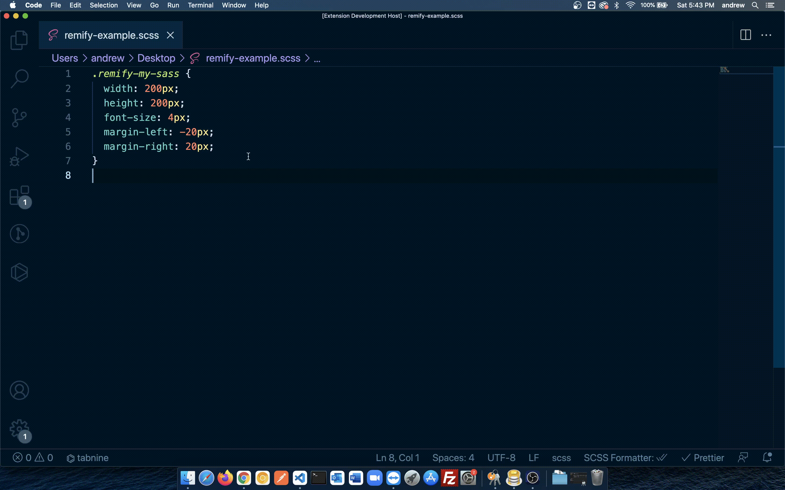

# Remify

## Features

Convert px values in sass files into rem() format using Remify command in the command palette.

## Release Notes

This is my first vscode extension, let me know what you think, and report all bugs!

### 1.0.0

Initial release of Remify is soon to be released.
